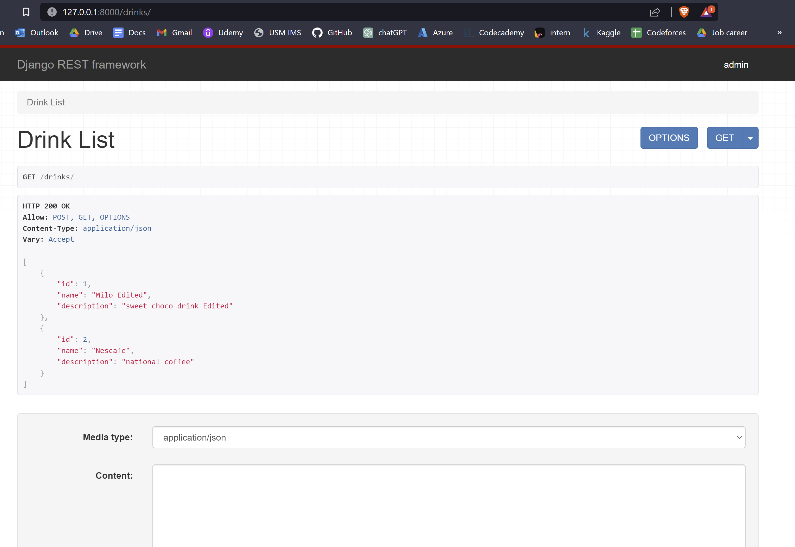

# How to create Django REST API from scratch

reference: [Django REST Framework - Build an API from Scratch](https://www.youtube.com/watch?v=i5JykvxUk_A)

## Create Django Admin and setup the database

### 1. Create and activate a virtual env (in Windows 11 and powershell)

- create your repo for your project

- run the command below to create a virtual environment

> `python -m venv <directory_name_for_venv>`

- activate your venv (for powershell)

> `<directory_name_for_venv>\Scripts\Activate.ps1`

### 2. Create and run Django App

- install necessary library

> `pip install django`
> `pip install djangorestframework`

you also can install all the libraries by using this code
> `pip install -r requirements.txt`

- run the Django app

> `python manage.py runserver`

- if you want to migrate the changes, run the migrate command

> `python manage.py migrate`

### 3. create an admin credential

- run createsuperuser command
`python manage.py createsuperuser`

- The admin superuser credential created:

| Details | Credential |
| ----------- | ----------- |
| Username | admin |
| Email address | 123@gmail.com|
| Password | 123|

now you can login as Django admin using the credential above

### 4. create the models for the database

- create `models.py` inside the repo that you created for django app
- inside the models.py include the code below.

> `from django.db import models`

- create your models based on your requirements. Example:

```python
from django.db import models

# Create your models here.
# models is a python file that contains the classes that represent the database tables
class Drink(models.Model):
    name = models.CharField(max_length=200)
    description = models.CharField(max_length=500)
    
    #as the name appeared in the table item
    def __str__(self):
        return self.name        
```

- go to `settings.py` and add your django repo into the `INSTALLED_APPS` 
```python
INSTALLED_APPS = [
    'your_django_repo_name',
    'django.contrib.admin',
    'django.contrib.auth',
    'django.contrib.contenttypes',
    'django.contrib.sessions',
    'django.contrib.messages',
    'django.contrib.staticfiles',
]        
```

- run `makemigrations` command to make the changes for the class/model created

`python manage.py makemigrations drinks`

- then run `migrate` to make sure all the migrations done is actually migrated

`python manage.py migrate`

### 5. make the models created appear in the admin page

 - create `admin.py` file inside the django repo
 - inside the `admin.py` create the code below so that the models you created just now can appear in admin page

```python
from django.contrib import admin
from .models import Drink

#pass the models, Drinks refer to the models aka the db table
admin.site.register(Drink)        
```    

- run the `runserver` command and navigate to `http://127.0.0.1:8000/admin/` to see the changes applied
`python manage.py runserver`

- you can manage add the instance db table item using the admin page. 

- now we gonna make this process become REST API


## Create a REST API

### 1. Start REST framework and create serializer

- go to `settings.py` and add `rest_framework` into the `INSTALLED_APPS`

```python
INSTALLED_APPS = [
  'rest_framework',  
    'your_django_repo_name',
    'django.contrib.admin',
    'django.contrib.auth',
    'django.contrib.contenttypes',
    'django.contrib.sessions',
    'django.contrib.messages',
    'django.contrib.staticfiles',
]        
```

- create a `serializers.py` file inside the django repo (serializers is used to convert the data into json format)

- inside the 'serializers.py` insert the code below

```python
# serializers is used to convert the data into json format
from rest_framework import serializers
from .models import Drink
# meta is used to define the model and fields
class DrinkSerializer(serializers.ModelSerializer):
    class Meta:
        model = Drink
        fields = ['id', 'name', 'description']
```

### 2. Create the view endpoints

- create a `views.py` inside the django repo (views.py is to view the endpoint)
- insert the code above inside `views.py` file

```python
# create endpoint(URL) to access the data at here
from django.http import JsonResponse
from .models import Drink
from .serializers import DrinkSerializer
def drink_list(request):
    # get all the drinks
    drinks = Drink.objects.all()
    # serialize the data
    serializer = DrinkSerializer(drinks, many=True) 
    # return the serialized data(JSON)
    # in order to allow non-dict objects to be serialized set the safe parameter to False
    return JsonResponse(serializer.data, safe = False)
```

- go to `urls.py`, add new path(Drink) in urlpatterns

```python
from django.contrib import admin
from django.urls import path
from drinks import views
urlpatterns = [
    path('admin/', admin.site.urls),
    path('drinks/',views.drink_list)
]
```

- run `runserver` command and go to drinks path to check whether it works or not
`http://127.0.0.1:8000/drinks/` , it should return a dictionary on the screen.

- now you created an API with only read(GET response), we need to add CRUD for our API.

## CRUD

- you can use the devtools to check the http status, go to devtools, find network option, and reload the `http://127.0.0.1:8000/drinks/`
- the status should 200 if the GET response is success.

### 1. create POST response and request

- go to views.py and add the code below

```python
# create endpoint(URL) to access the data at here
from django.http import JsonResponse
from .models import Drink
from .serializers import DrinkSerializer
from rest_framework.decorators import api_view
from rest_framework.response import Response
from rest_framework import status


@api_view(['GET', 'POST'])
def drink_list(request):
    # GET method is used to get data
    if request.method == 'GET':
        # for GET request(ask for data)
        # get all the drinks
        drinks = Drink.objects.all()
        # serialize the data
        serializer = DrinkSerializer(drinks, many=True)
        # return the serialized data(JSON)
        # in order to allow non-dict objects to be serialized set the safe parameter to False
        # since we are in dict, so can set safe to True
        return JsonResponse({"drinks": serializer.data})

    # POST method is used to post data
    if request.method == 'POST':
        serializer = DrinkSerializer(data=request.data)
        if serializer.is_valid():
            serializer.save()
            return Response(serializer.data, status=status.HTTP_201_CREATED)
```

- test the GET and POST response using POSTMAN API app
- GET response result


- POST response result (add new data)


### 2. access the item by id using url 

now i want to access the data by its id instead of all(example: `http://127.0.0.1:8000/drinks/1`)
we have to create new url path and new function

- create new url path (add the code below in `urls.py`)

```python
urlpatterns = [
    path('admin/', admin.site.urls),
    path('drinks/', views.drink_list),
    # drinks/<int:id> is to get the id of the drink and view the details of the drink in different page
    path('drinks/<int:id>', views.drink_detail)
]
```

for now the drink_detail is not created yet, we need to create it in `views.py`

- go to `views.py` and add the code below

```python
# attribute for the drink_detail function, get, put, delete
@api_view(['GET', 'PUT', 'DELETE'])
def drink_detail(request, id):
    # pk is primary key
    # get the drink by id
    # it is to make sure the drink exists
    try:
        drink = Drink.objects.get(pk=id)
    except Drink.DoesNotExist:
        return Response(status=status.HTTP_404_NOT_FOUND)

    if request.method == 'GET':
        # get the data of the drink
        serializer = DrinkSerializer(drink)
        return Response(serializer.data)
    elif request.method == 'PUT':
        # update the data of the drink
        serializer = DrinkSerializer(drink, data=request.data)
        if serializer.is_valid():
            serializer.save()
            return Response(serializer.data)
        return Response(serializer.errors, status=status.HTTP_400_BAD_REQUEST)
    elif request.method == 'DELETE':
        pass
```

- test the GET(get data) and PUT(change the existing data) response using POSTMAN app

- GET response result by id


- PUT response result by id (change the attribute of existing data)
- can use GET response to check the amended result


- add DELETE response in `views.py`

```python
@api_view(['GET', 'PUT', 'DELETE'])
def drink_detail(request, id):
    # pk is primary key
    # get the drink by id
    # it is to make sure the drink exists
    try:
        drink = Drink.objects.get(pk=id)
    except Drink.DoesNotExist:
        return Response(status=status.HTTP_404_NOT_FOUND)

    if request.method == 'GET':
        # get the data of the drink
        serializer = DrinkSerializer(drink)
        return Response(serializer.data)
    elif request.method == 'PUT':
        # update the data of the drink
        serializer = DrinkSerializer(drink, data=request.data)
        if serializer.is_valid():
            serializer.save()
            return Response(serializer.data)
        return Response(serializer.errors, status=status.HTTP_400_BAD_REQUEST)
    elif request.method == 'DELETE':
        drink.delete()
        return Response(status=status.HTTP_204_NO_CONTENT)
```

- Test DELETE response


- GET response after DELETE the item


- everything works well, now we need to put back the result to our original url(`http://127.0.0.1:8000/drinks/`) which is `drink_list` function

### 3. edit the drink_list function for `http://127.0.0.1:8000/drinks/`

- go back to `views.py` and edit `drink_list` function

```python
@api_view(['GET', 'POST'])
def drink_list(request):
    # GET method is used to get data
    if request.method == 'GET':
        # for GET request(ask for data)
        # get all the drinks
        drinks = Drink.objects.all()
        # serialize the data
        serializer = DrinkSerializer(drinks, many=True)
        # return the serialized data(JSON)
        # in order to allow non-dict objects to be serialized set the safe parameter to False
        # since we are in dict, so can set safe to True
        # CHANGE:
        # change the return result to Response serializer.data
        return Response(serializer.data)

    # POST method is used to post data
    if request.method == 'POST':
        serializer = DrinkSerializer(data=request.data)
        if serializer.is_valid():
            serializer.save()
            return Response(serializer.data, status=status.HTTP_201_CREATED)

```

-Now when you re-run the `http://127.0.0.1:8000/drinks/`, should appear the result below


- Now go to `http://127.0.0.1:8000/drinks/1` and edit the data using `content` and click `PUT` request


- The result should be like this




## Getting JSON from browser

- now i want to access the json data using the browser or url directly like this `http://127.0.0.1:8000/drinks.json`

- add the code below into `urls.py`

```python
from rest_framework.urlpatterns import format_suffix_patterns
urlpatterns = format_suffix_patterns(urlpatterns)
```

- add `format` paramater into the functions in `views.py`
```python
def drink_list(request, format=None):
    ---

def drink_detail(request, id, format=None):
    ---
```

## Consuming the API
now we have the API ady, we can call the API for our frontend

Make sure you keep the Django server run

Create a new empty py file `consume.py` at the main repo and add the code below.

```python
import requests
response = requests.get('http://127.0.0.1:8000/drinks/')
print(response.json())
```

run `python consume.py` command and you will see the result below

`[{'id': 1, 'name': 'Milo Edited', 'description': 'sweet choco drink Edited'}, {'id': 2, 'name': 'Nescafe', 'description': 'national coffee'}]`

Congratulations, you have called the API successfully.

Now, you can connect the API to your frontend and use it. 